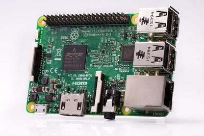
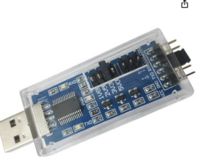
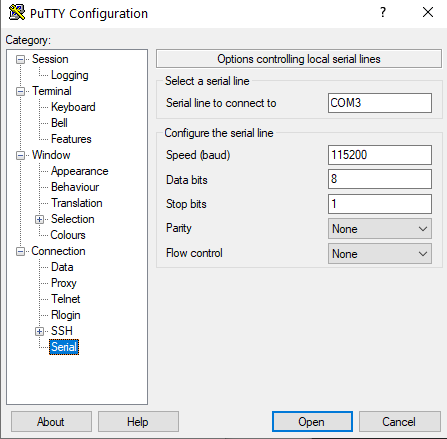
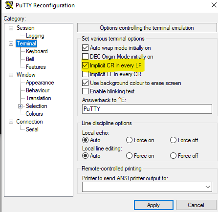
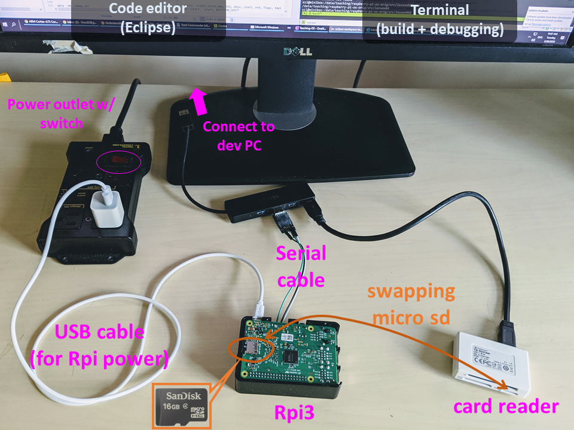
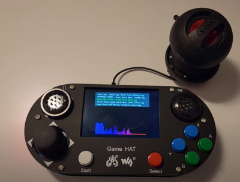
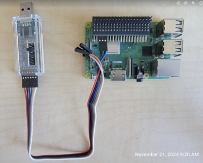
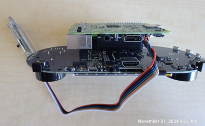
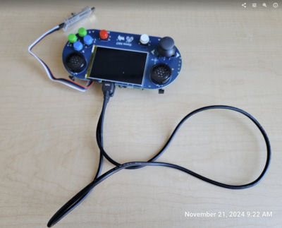

# Setup the raspi3 hardware


## Check list


### Student provide: An Rpi3 board (Model B or B+) [link](https://www.raspberrypi.org/products/raspberry-pi-3-model-b/)




### We provide the following, based on your needs:

- A USB-serial cable. We use: SH-V09C5



> Some old adapters no longer works for WSL2 (Windows driver issues); however they still works for Linux/VM. 

- A 32GB micro SD card preloaded with firmware

- A SD card reader

- A portable display (inc. HDMI cable and USB-C power supply)

- USB keyboard

- Power supply for Rpi3

- Waveshare GAME HAT (inc. battery; HDMI cable; 40pin header extender; speaker) 


## Plug in the serial cable

```
Rpi3 <-- a USB-serial cable ---> PC (running a temrinal emulator) 
```

After you get a serial cable, you need to test your connection. If you never did this before I recommend you to follow [this guide](https://cdn-learn.adafruit.com/downloads/pdf/adafruits-raspberry-pi-lesson-5-using-a-console-cable.pdf) It describes the process of connecting your Raspberry PI via a serial cable in great details. Basically, you run Raspberry's official OS to ensure the hardware setup is fine. 


## Configure the serial emulator

### VM/Linux users: see [VMware](vmware.md)

```
sudo minicom -b 115200 -o -D /dev/ttyUSB0 -C /tmp/minicom.log
```

### WSL2 users: PuTTY recommended. A sample configuration below. 



Change the terminal settings like this:



Note: your PC may give different names to the USB-serial dongle, e.g. COM4. Find it out by looking at Windows Device Manager. 

### Powering up RPi3

Use the provided power supply. You may be attempted to connect Rpi3's power port (micro USB) to your PC's USB port. This is NOT recommended. The power supply from PC's USB port is not enough. 

### An example setup



## GAMEHAT setup

Follow the Waveshare website instructions to assemble it. LEAVE THE back cover off. Plug in the speaker for sound. Insert SD card and power up.



However the UART pins are blocked. To access it for debugging: 

Connect the 40pin header extender to the Rpi3. The connect the serial cable to the extender.



Put Rpi3 back on



Connect the display to the Rpi3 via a HDMI cable (the hard HDMI connector that comes with the gamehat is too short -- not used).




